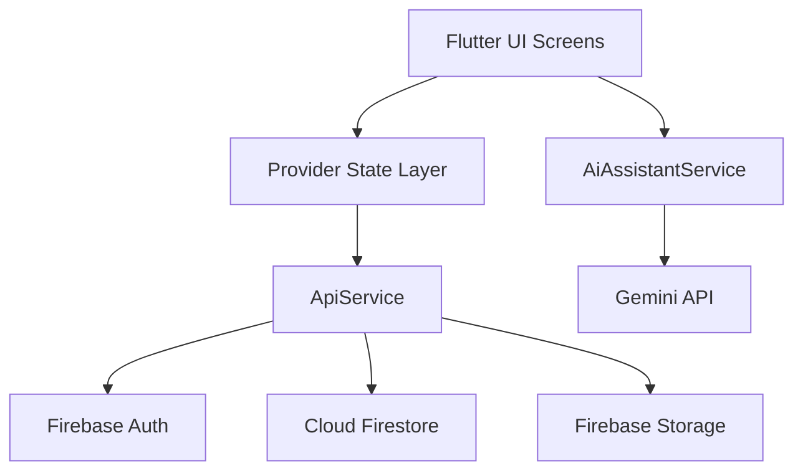

# MDT Inventory App

Production-oriented Flutter application for inventory management, issue tracking, and operational reporting in institutional IT environments.

## Table of Contents

- [Product Summary](#product-summary)
- [Core Capabilities](#core-capabilities)
- [Role Model](#role-model)
- [Architecture](#architecture)
- [Technology Stack](#technology-stack)
- [Project Layout](#project-layout)
- [Firestore Schema](#firestore-schema)
- [Prerequisites](#prerequisites)
- [Setup Guide](#setup-guide)
- [Run Guide](#run-guide)
- [Configuration and Secrets](#configuration-and-secrets)
- [Security and Safe GitHub Push](#security-and-safe-github-push)
- [Optional Node Backend](#optional-node-backend)
- [Developer Workflow](#developer-workflow)
- [Troubleshooting](#troubleshooting)
- [Roadmap](#roadmap)

## Product Summary

MDT Inventory App centralizes device records and issue workflows:

- Register, update, and track devices
- Scan QR codes to resolve devices quickly
- Report and manage incidents
- Notify users and staff on issue events
- Export operational reports in CSV/XLSX
- Provide an AI troubleshooting assistant

The app is powered by Firebase Authentication, Cloud Firestore, and Firebase Storage.

## Core Capabilities

- Email/password authentication via Firebase Auth
- Sign-up domain policy: `@mdt.gov.mk`
- Role-based authorization (`admin`, `staff`, `viewer`)
- Device statuses: `New`, `Good`, `Broken`, `In Repair`
- Issue lifecycle updates with assignment support
- Per-user notification feed
- Audit logging for critical operations
- Reports grouped by status, location, and device type
- Export and sharing support for CSV and Excel files
- Localization support (Macedonian + English)
- Gemini-powered AI assistant screen

## Role Model

| Role | Typical Access |
|---|---|
| `admin` | Reports, logs, user role management, inventory operations |
| `staff` | Device operations and issue reporting/updating |
| `viewer` | Read-only browsing of available data |

Role data is stored in Firestore under `users/{uid}.role`.

## Architecture



## Technology Stack

| Layer | Tools |
|---|---|
| Client | Flutter, Dart 3 |
| State management | `provider` |
| Auth | `firebase_auth` |
| Database | `cloud_firestore` |
| Files/media | `firebase_storage` |
| QR scanning | `mobile_scanner` |
| Export/share | `csv`, `excel`, `share_plus` |
| HTTP integrations | `http` |

## Project Layout

```text
lib/
  main.dart
  firebase_options.dart
  localization/
  models/
  providers/
  screens/
  services/
  utils/
android/
ios/
macos/
web/
windows/
linux/
functions/                 # local Node dependencies (not versioned)
lib/backend/index.js       # optional Node/Express backend example
```

### Important Modules

- `lib/main.dart`: app bootstrap, providers, global theme
- `lib/providers/auth_provider.dart`: auth session + role lifecycle
- `lib/providers/language_provider.dart`: localization state
- `lib/services/local_api_service.dart`: Firestore/Storage integration + business operations
- `lib/services/ai_assistant_service.dart`: Gemini request orchestration
- `lib/screens/`: user and admin flows
- `lib/models/`: typed app entities

## Firestore Schema

### Collection: `devices`

| Field | Type | Description |
|---|---|---|
| `id` | string | Device ID / QR value |
| `name` | string | Device display name |
| `type` | string | Device type/category |
| `brand` | string | Manufacturer |
| `model` | string | Model name |
| `location` | string | Physical location |
| `assignedTo` | string | Assigned person/email label |
| `status` | string | `New`/`Good`/`Broken`/`In Repair` |
| `notes` | string | Additional details |
| `imageUrl` | string? | Optional uploaded image URL |
| `createdAt` | timestamp | Server timestamp |
| `updatedAt` | timestamp | Server timestamp |

### Collection: `issues`

| Field | Type | Description |
|---|---|---|
| `deviceId` | string | Linked device ID |
| `description` | string | Issue description |
| `status` | string | Issue status |
| `reporterId` | string | UID of reporter |
| `assignedTo` | string? | Assignee email |
| `imageUrl` | string? | Optional image |
| `location` | string | Report location |
| `createdAt` | timestamp | Server timestamp |
| `updatedAt` | timestamp | Server timestamp |

### Collection: `users`

| Field | Type | Description |
|---|---|---|
| `email` | string | User email |
| `role` | string | `admin`/`staff`/`viewer` |
| `createdAt` | timestamp | Server timestamp |
| `updatedAt` | timestamp | Server timestamp |

### Subcollection: `users/{uid}/notifications`

| Field | Type | Description |
|---|---|---|
| `title` | string | Notification title |
| `message` | string | Notification body |
| `issueId` | string? | Related issue |
| `deviceId` | string? | Related device |
| `read` | bool | Read status |
| `createdAt` | timestamp | Server timestamp |

### Collection: `logs`

| Field | Type | Description |
|---|---|---|
| `action` | string | Event name (`device_created`, etc.) |
| `entityType` | string | Domain entity (`device`, `issue`, `user`) |
| `entityId` | string | Entity identifier |
| `actorId` | string | UID performing action |
| `actorEmail` | string | Actor email |
| `details` | map? | Optional metadata |
| `createdAt` | timestamp | Server timestamp |

## Prerequisites

- Flutter SDK 3.x
- Android Studio + Android SDK
- Xcode + CocoaPods (for iOS/macOS builds)
- Firebase project with:
  - Email/Password authentication enabled
  - Cloud Firestore enabled
  - Firebase Storage enabled

## Setup Guide

1. Install dependencies.

```bash
flutter pub get
```

2. Configure Firebase with FlutterFire CLI.

```bash
dart pub global activate flutterfire_cli
flutterfire configure
```

3. Confirm local platform config files exist.

```text
android/app/google-services.json
ios/Runner/GoogleService-Info.plist
macos/Runner/GoogleService-Info.plist
```

4. Run app with runtime defines (Gemini + Firebase).

```bash
flutter run \
  --dart-define=GEMINI_API_KEY=your_gemini_key \
  --dart-define=FIREBASE_PROJECT_ID=your_project_id \
  --dart-define=FIREBASE_MESSAGING_SENDER_ID=your_sender_id \
  --dart-define=FIREBASE_STORAGE_BUCKET=your_storage_bucket \
  --dart-define=FIREBASE_WEB_API_KEY=your_web_api_key \
  --dart-define=FIREBASE_WEB_APP_ID=your_web_app_id \
  --dart-define=FIREBASE_WEB_AUTH_DOMAIN=your_web_auth_domain \
  --dart-define=FIREBASE_WEB_MEASUREMENT_ID=your_web_measurement_id \
  --dart-define=FIREBASE_ANDROID_API_KEY=your_android_api_key \
  --dart-define=FIREBASE_ANDROID_APP_ID=your_android_app_id \
  --dart-define=FIREBASE_IOS_API_KEY=your_ios_api_key \
  --dart-define=FIREBASE_IOS_APP_ID=your_ios_app_id \
  --dart-define=FIREBASE_IOS_BUNDLE_ID=your_ios_bundle_id \
  --dart-define=FIREBASE_MACOS_API_KEY=your_macos_api_key \
  --dart-define=FIREBASE_MACOS_APP_ID=your_macos_app_id \
  --dart-define=FIREBASE_MACOS_BUNDLE_ID=your_macos_bundle_id
```

## Run Guide

- Android: `flutter run -d android`
- iOS: `flutter run -d ios`
- macOS: `flutter run -d macos`
- Web: `flutter run -d chrome`

## Configuration and Secrets

- Gemini API key is injected via compile-time define: `--dart-define=GEMINI_API_KEY=...`
- Firebase options are also injected at runtime via `--dart-define` values in `lib/firebase_options.dart`.
- No key should be hardcoded in source code.
- Mobile platform Firebase files remain local and gitignored.

## Security and Safe GitHub Push

Private/local files are protected via `.gitignore`, including:

- `.env` and `.env.*`
- `android/local.properties`
- `android/key.properties`
- `android/app/google-services.json`
- `ios/Runner/GoogleService-Info.plist`
- `macos/Runner/GoogleService-Info.plist`
- keystore and certificate files (`*.jks`, `*.keystore`, `*.pem`, `*.p12`, `*.key`)
- local dependency/build directories (`functions/node_modules`, `ios/Pods`, `macos/Pods`, build outputs)

Safe push checklist:

1. Verify ignored sensitive files:
   `git check-ignore -v android/app/google-services.json ios/Runner/GoogleService-Info.plist macos/Runner/GoogleService-Info.plist`
2. Review staged changes:
   `git diff --staged`
3. Scan text for accidental secrets:
   `rg -n "AIza|secret|token|PRIVATE KEY|password\\s*=" lib android ios macos`
4. Push:
   `git push -u origin main`

If a key was exposed previously, rotate/revoke it before publishing.

## Optional Node Backend

`lib/backend/index.js` provides an optional local API example using:

- Express
- Firebase Admin SDK
- Firebase ID token verification middleware

Do not commit service account credentials:

- local only: `lib/backend/serviceAccountKey.json`
- keep out of Git at all times

## Developer Workflow

Useful commands:

```bash
flutter pub get
flutter analyze
flutter test
flutter run --dart-define=GEMINI_API_KEY=your_key_here --dart-define=FIREBASE_PROJECT_ID=...
```

Recommended conventions:

- Keep business logic in `services/`
- Keep auth and locale state in `providers/`
- Add strings in localization layer for both MK and EN
- Ensure role checks exist for privileged screens/actions
- Add log entries for critical writes

## Troubleshooting

- Firebase init errors:
  Re-run `flutterfire configure` and verify platform config files.
- Login/sign-up fails for valid users:
  Confirm Email/Password provider is enabled in Firebase Auth.
- Sign-up rejected:
  Ensure email ends with `@mdt.gov.mk`.
- AI assistant returns missing key:
  Start app with `--dart-define=GEMINI_API_KEY=...`.
- iOS/macOS pod issues:
  Run `pod install` in the corresponding `ios` or `macos` folder.

## Roadmap

- Add charts dashboard for trends over time
- Add offline cache strategy for inventory reads
- Add structured Firestore security rules documentation
- Add CI pipeline for analyze/test/build checks

## License

This repository currently has no OSS license file. Treat it as private/internal unless a license is explicitly added.
